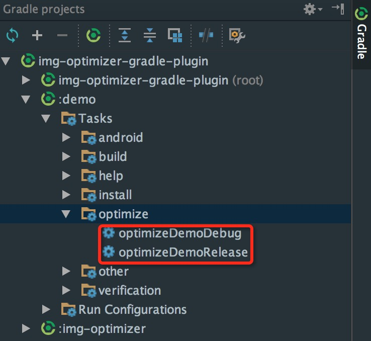

 [](http://www.apache.org/licenses/LICENSE-2.0.html) [](https://android-arsenal.com/details/1/3863) [](https://github.com/chenenyu/img-optimizer-gradle-plugin/stargazers)

# img-optimizer-gradle-plugin

>一款用于优化png图片的gradle插件，有效减少APK体积，支持极限压缩和无损压缩。

### 支持的OS

在`macOS`、`windows10`、`Ubuntu16.04LTS(amd64)`上测试通过，如果有更多需求，请提issue。

### 如何使用

在Project的build.gradle文件中:  

```
buildscript {
    repositories {
        mavenCentral()
        // jcenter()
    }
    dependencies {
        ...
        classpath 'com.chenenyu:img-optimizer:版本号'
    }
}
```  

然后在你想要优化的module的build.gradle文件中:  

`apply plugin: 'img-optimizer'`  

然后在task tree里面就可以看到对应的task:  
  
双击即可执行。task的名字受当前module的命名影响。

### 支持的配置项
可以在module的build.gradle文件中添加配置选项，来自定义任务:  

```
optimizerOptions {
    triggerSize 5
    type "lossy"
    suffix "_opt"
}
```  

1. `triggerSize` 用于过滤图片，小于该值的图片不会进行优化。默认为0，即每张图片都进行优化。
2. `type` 优化类型，目前支持`"lossy"`和`"lossless"`。`"lossy"`为极限压缩(推荐，速度快，压缩率高)，`"lossless"`为无损压缩(速度慢，压缩率低，与原图无差别)。
3. `suffix` 优化后的图片后缀。假如配置为`"_opt"`，`ic_launcher.png`经过优化后，将会生成`ic_launcher_opt.png`。默认为空，即覆盖原图。

### 效果预览

|原图|极限压缩(lossy)|无损压缩(lossless)|
|:---:|:---:|:---:|
|526K|195K(减少63%)|473K(减少10%)|
||||

### 说明

如果项目有多个module，请在相应的build.gradle中配置plugin，每个module相互独立。执行task后会在module根目录下生成log文件，详细记录了每张图片的优化情况，方便查看。

### License

[Apache 2.0](http://www.apache.org/licenses/LICENSE-2.0.html)